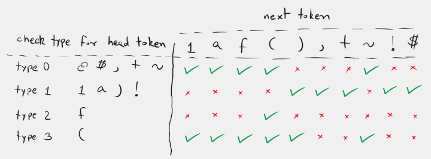
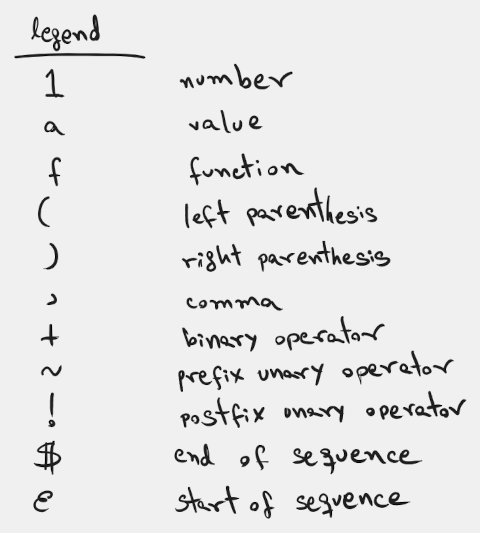

# Shunting yard

A simple (but extensible) parsing project that uses E. Dijkstra's [Shunting yard algorithm](#external-links).

This project is intended to be a simple approach through a parsing process, basically using the Shunting yard algorithm in order to evaluate arithmetic expressions. The process itself is split in three steps: lexicographic analysis where a lexer will recognize valid tokens, syntax analysis where a parser will check the sequences of tokens are well formed before transforming them into evaluable sequences, and last, the evaluation step takes place by computing results for the input expressions.

One goal of the project is to allow customizing and/or extending it through giving it a context of symbols that can be recognized and they will have an associated semantic meaning, such as numeric constants, function symbols and operators.

---

### Files:

**App source**
- `main.cpp`
- `my_context.hpp`

**Core source**
- `context.hpp`
- `lexer.hpp`
- `parser.hpp`

---

### Setup:

Use the `CMakeLists.txt` file to compile the project.

---

### Guide

`TODO: add a walkthrough of the project structure.`

*Table of valid head-next tokens sequences.*

*Legend for the table of valid head-next tokens sequences.*

---

### External links:

- [Wikipedia: Shunting_yard_algorithm](https://en.wikipedia.org/wiki/Shunting_yard_algorithm)
